# VSentry - SIEM + SOAR Platform

<p align="center">
  <a href="https://github.com/laenix/vsentry">
    
  </a>
  <a href="https://github.com/laenix/vsentry/blob/main/LICENSE">
    
  </a>
  <a href="https://github.com/laenix/vsentry/releases">
    
  </a>
</p>

<p align="center">
  
  
  
</p>

VSentry is an open-source SIEM (Security Information and Event Management) + SOAR (Security Orchestration, Automation and Response) platform designed for small to medium enterprises.

## 🚀 Features

### Core SIEM Features
- **Log Collection & Ingestion** - HTTP API with token authentication
- **Log Storage** - Powered by VictoriaLogs for high-performance storage
- **Log Query** - Search and analyze logs with LogSQL
- **Custom Tables** - Define custom log groupings using stream fields
- **OCSF Support** - Open Cybersecurity Schema Framework compliant log normalization

### Detection & Response
- **Detection Rules** - Create rules with cron-based scheduling
- **Incident Management** - Track and manage security incidents
- **SOAR Automation** - Visual workflow automation with React Flow

### Integrations
- **Connectors** - Pre-built integrations for 24+ security tools
- **Collectors** - Build native Go agents for Windows, Linux, and macOS with OCSF output support

### Administration
- **User Management** - Multi-user with role-based access
- **System Settings** - Configure external URLs and parameters

## 📸 Screenshots

### 1. Dashboard
<p align="center">
  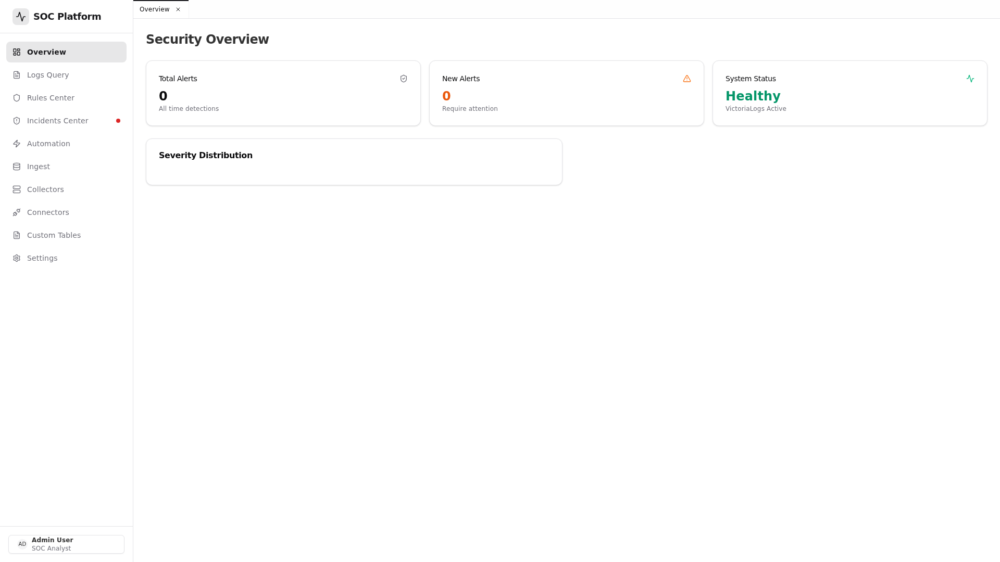
  <br><em>Real-time security overview with alerts, severity distribution, and recent activity</em>
</p>

### 2. Logs - Query & Analysis
<p align="center">
  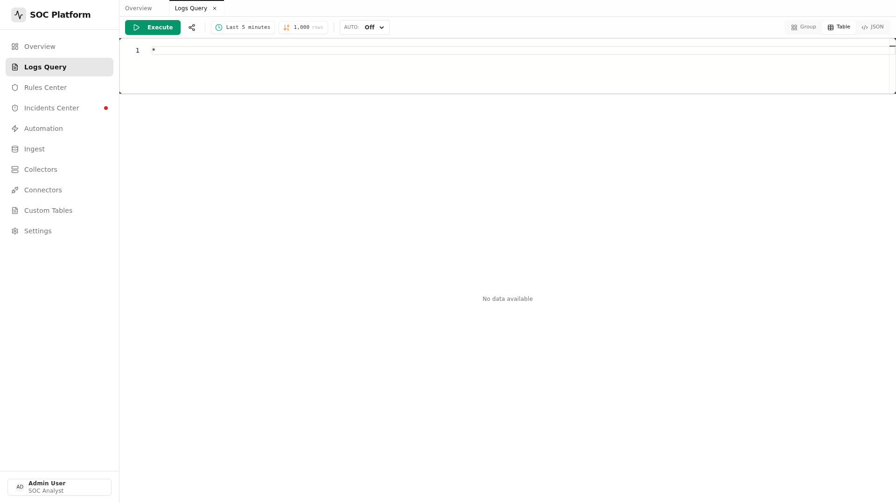
  <br><em>Powerful LogSQL-based log query with time range filtering, real-time search, and multiple view modes</em>
</p>

### 3. Rules - Detection Rules
<p align="center">
  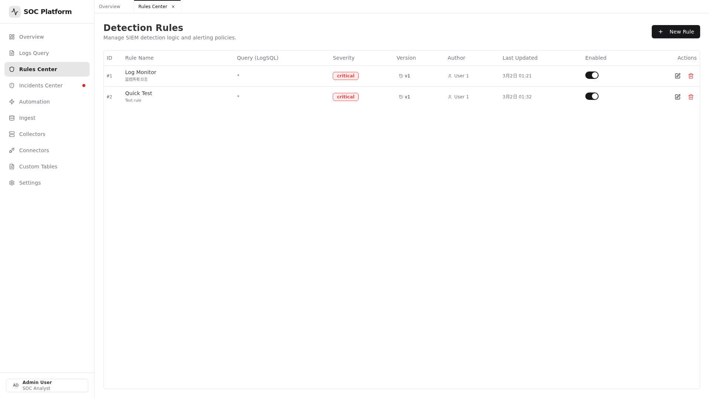
  <br><em>Rules list page showing all detection rules and their status</em>
</p>

<p align="center">
  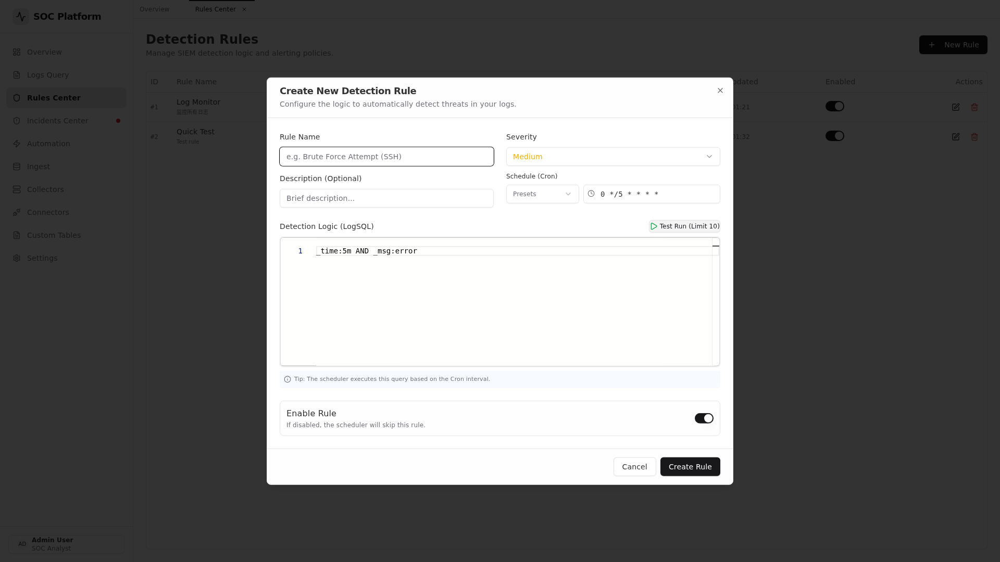
  <br><em>Create/Edit rules with LogSQL expressions, cron scheduling (down to seconds), and severity levels</em>
</p>

### 4. Incidents
<p align="center">
  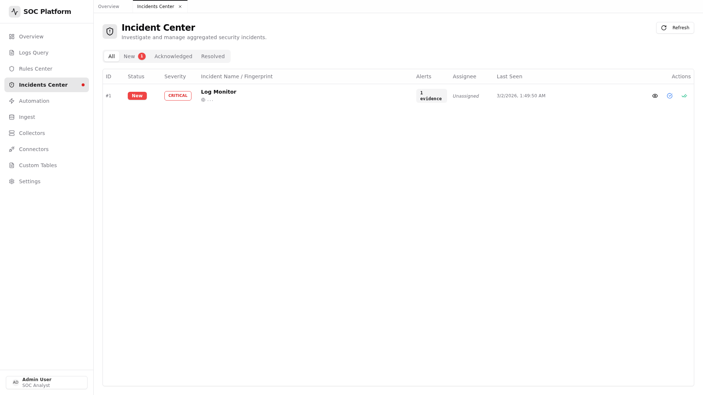
  <br><em>Security incident center: auto-generated alerts when logs match rules, showing status, severity, count</em>
</p>

<p align="center">
  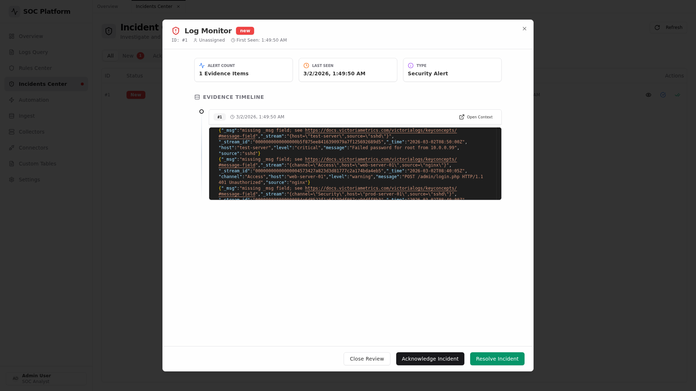
  <br><em>Incident detail modal: view raw logs, severity, status; support acknowledge/resolve actions</em>
</p>

### 5. Automation - SOAR
<p align="center">
  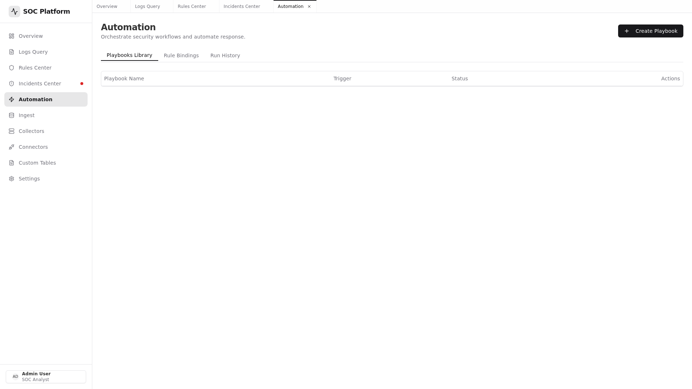
  <br><em>Visual workflow orchestration connecting detection rules to response actions (HTTP, email, conditions)</em>
</p>

### 6. Ingest - Log Endpoints
<p align="center">
  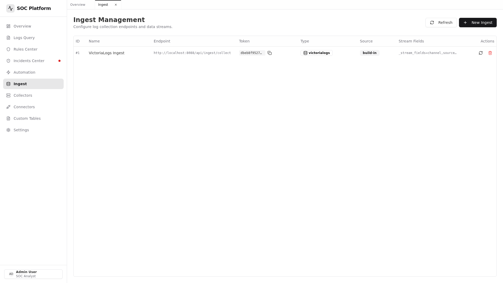
  <br><em>Log endpoint management: generate API addresses and auth tokens for collectors to push logs</em>
</p>

### 7. Collectors - Log Agents
<p align="center">
  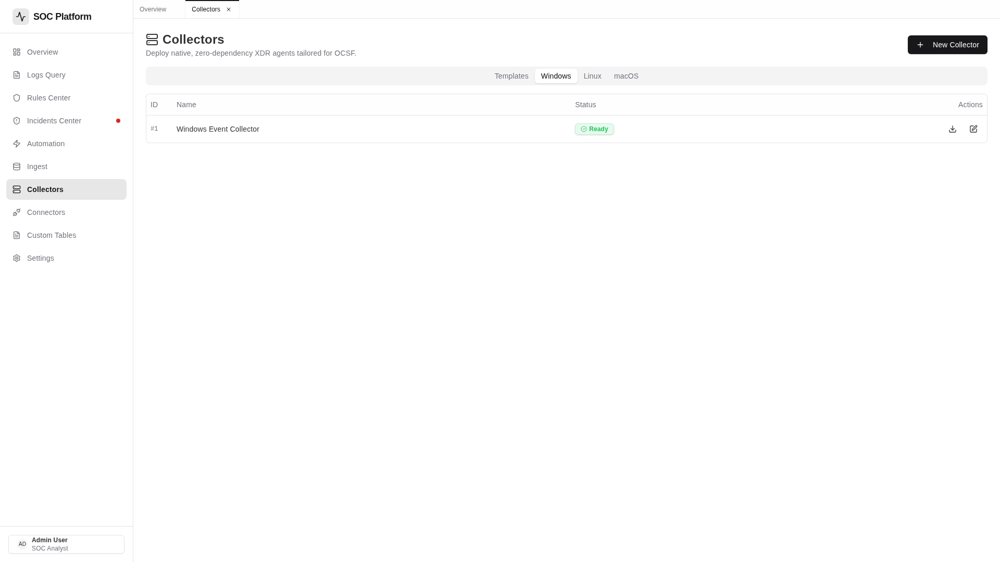
  <br><em>Build cross-platform log collectors (Windows/Linux/macOS) with one-click config generation</em>
</p>

<p align="center">
  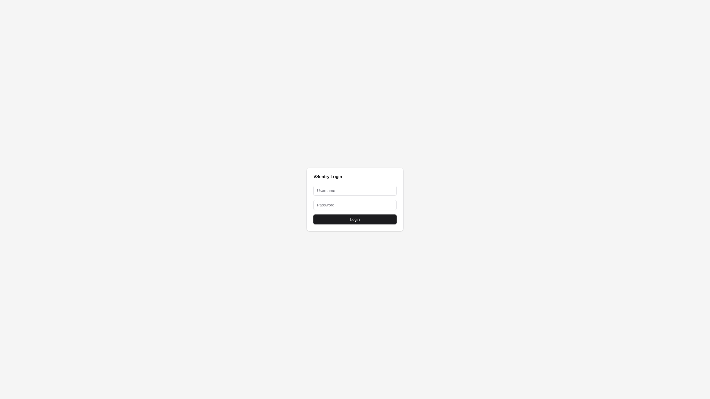
  <br><em>Select template and configure collector: choose data sources, mapping rules, target endpoint</em>
</p>

<p align="center">
  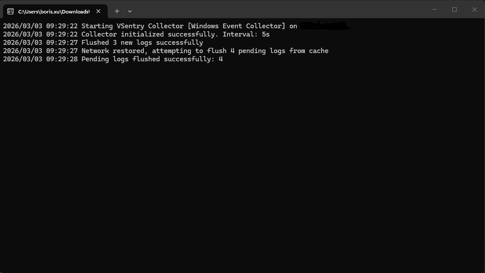
  <br><em>Windows Event Collector: Native Go agent, zero-dependency deployment, OCSF format output</em>
</p>

### 8. Settings
<p align="center">
  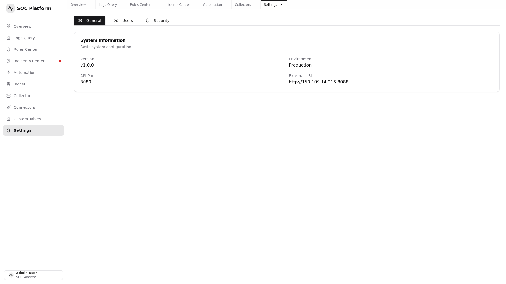
  <br><em>System administration: user management, collector config, appearance settings</em>
</p>

## 🏗️ Architecture

```
┌─────────────────────────────────────────────────────────────┐
│                  Go + Gin (Port 8088)                       │
│  ┌─────────────────┐    ┌─────────────────────────────────┐ │
│  │   React SPA     │    │   REST API + Ingest Endpoint   │ │
│  │  (Static Files) │    │   (Auth, Rules, Playbooks...)  │ │
│  └─────────────────┘    └─────────────────────────────────┘ │
└─────────────────────────┬───────────────────────────────────┘
                          │
        ┌─────────────────┼─────────────────┐
        │                 │                 │
        ▼                 ▼                 ▼
┌───────────────┐  ┌───────────────┐  ┌─────────────┐
│ VictoriaLogs  │  │   SQLite      │  │  Collector  │
│ (Log Storage) │  │  (Metadata)   │  │   Agents    │
│   :9428       │  │               │  │  (Push)     │
└───────────────┘  └───────────────┘  └─────────────┘
```

## 📦 Quick Start

### Prerequisites
- Go 1.25+
- Node.js 18+
- Docker & Docker Compose (optional)

### Using Docker Compose (Recommended)

```bash
# Clone the repository
git clone https://github.com/laenix/vsentry.git
cd vsentry

# Start all services
make docker-up

# Access at http://localhost:8088
# Default login: admin / admin123
```

### Manual Setup

#### Backend

```bash
cd backend

# Build
go build -o vsentry .

# Run
./vsentry
```

#### Frontend

```bash
cd frontend

# Install dependencies
npm install

# Development
npm run dev

# Production build
npm run build
```

## 🔧 Configuration

### Using Environment Variables (Recommended)

When running with Docker Compose, you can use environment variables to override settings:

```bash
# Method 1: Using .env file
echo "EXTERNAL_URL=http://your-server-ip:8088" > .env
docker-compose up -d

# Method 2: Direct command line
EXTERNAL_URL=http://192.168.1.100:8088 docker-compose up -d
```

**Available Environment Variables:**

| Variable | Description | Default |
|----------|-------------|---------|
| `EXTERNAL_URL` | External URL for collector endpoint generation | `http://localhost:8088` |
| `VICTORIALOGS_URL` | VictoriaLogs service URL | `http://victorialogs:9428` |
| `JWT_SECRET` | JWT secret key | `your-secret-key-change-in-production` |

> **Tip**: For production, always set `EXTERNAL_URL` to your public IP or domain (e.g., `http://192.168.1.100:8088` or `https://vsentry.yourdomain.com`). This ensures the built collectors can correctly report to your server.

### Using Config File

Configuration file: `backend/config/config.yaml`

```yaml
server:
  port: "8080"
  external_url: "http://localhost:8088"
  
victorialogs:
  url: "http://localhost:9428"
  
database:
  path: "vsentry.db"
  
jwt:
  secret: your-secret-key-change-me
```

## 🌐 API Endpoints

| Path | Method | Description |
|------|--------|-------------|
| `/api/login` | POST | User login |
| `/api/ingest/collect` | POST | Log ingestion (with token) |
| `/api/ingestmanager/*` | * | Ingest management |
| `/api/connectors/*` | * | Third-party integrations |
| `/api/collectors/*` | * | Collector builder |
| `/api/customtables/*` | * | Custom table definitions |
| `/api/rules/*` | * | Detection rules |
| `/api/incidents/*` | * | Incident management |
| `/api/playbooks/*` | * | SOAR automation |
| `/api/users/*` | * | User management |
| `/api/select/logsql/query` | POST | Log query (auth required) |
| `/api/select/logsql/hits` | POST | Query hits count |

## 📁 Project Structure

```
vsentry/
├── backend/           # Go backend (Gin + GORM)
│   ├── controller/    # HTTP handlers
│   ├── model/         # Data models
│   ├── middleware/    # Auth middleware
│   ├── ingest/        # Log ingestion
│   ├── automation/    # SOAR engine
│   └── config/        # Configuration
├── frontend/          # React frontend
│   ├── src/
│   │   ├── pages/     # Page components
│   │   ├── services/  # API services
│   │   └── lib/       # Utilities
│   └── public/        # Static assets
├── config/            # Sample configs
├── scripts/           # Utility scripts
├── docs/              # Documentation
├── docker-compose.yml # Docker compose
├── nginx.conf         # Nginx config
├── Makefile           # Build automation
└── README.md          # This file
```

## 🔌 Supported Integrations

### Security Tools
- Palo Alto Networks
- CrowdStrike
- AWS CloudTrail
- Azure Sentinel
- GCP Cloud Logging
- Splunk
- Elasticsearch
- FortiGate
- Cisco Umbrella
- Mimecast

### More
See `backend/controller/connector.go` for full list.

## 🤝 Contributing

Contributions are welcome! Please read our [Contributing Guide](docs/CONTRIBUTING.md) first.

1. Fork the repo
2. Create your feature branch (`git checkout -b feature/amazing`)
3. Commit your changes (`git commit -m 'Add amazing feature'`)
4. Push to the branch (`git push origin feature/amazing`)
5. Open a Pull Request

## 📝 License

This project is licensed under the MIT License - see the [LICENSE](LICENSE) file for details.

## 🙏 Acknowledgments

- [VictoriaMetrics](https://victoriametrics.com/) - Log storage
- [Gin](https://gin-gonic.com/) - Web framework
- [React Flow](https://reactflow.dev/) - Workflow automation UI

---

Built with ❤️ by [Boris Xu](https://github.com/laenix)