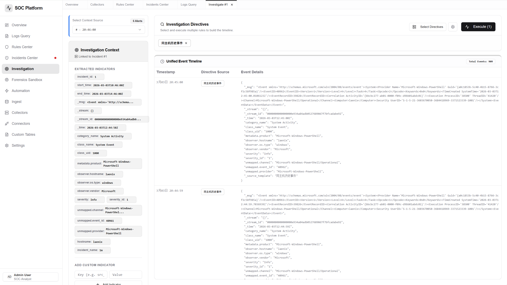
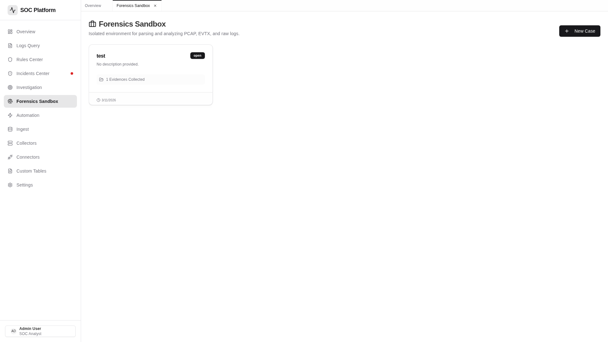

# VSentry - 云原生 SIEM + SOAR 平台

<p align="right">
  <a href="README.md">English</a>
</p>

<p align="center">
  <a href="https://github.com/laenix/vsentry">
    
  </a>
  <a href="https://github.com/laenix/vsentry/blob/main/LICENSE">
    
  </a>
  <a href="https://github.com/laenix/vsentry/releases">
    
  </a>
  <a href="https://kubernetes.io">
    
  </a>
</p>

<p align="center">
  
  
  
</p>

**VSentry** 是一个云原生 SIEM（安全信息与事件管理）+ SOAR（安全编排、自动化与响应）平台，专为现代 Kubernetes 环境设计。为需要企业级检测和响应能力的安全团队打造，却无需承担企业级的复杂性。

> **愿景**：成为 Falco 和 Tetragon 等云原生运行时安全工具缺失的 DFIR（数字取证与事件响应）控制平面。

## 🛡️ 为什么选择 VSentry？

- **云原生优先**：从零设计适配 Kubernetes，支持 Helm 部署和云原生数据流水线
- **原生 OCSF 支持**：全面支持开放网络安全架构框架 - 接收、规范化、分析供应商中立的安全事件
- **容器生命周期取证**：专为容器短生命周期设计，在证据消失前完成捕获
- **Falco/Tetragon 控制台**：填补 CNCF 运行时安全项目的响应层空白
- **开源透明**：Apache 2.0 许可证，社区驱动

## 🚀 功能特性

### 核心 SIEM 功能
- **日志采集与摄取** - 基于 Token 认证的 HTTP API，原生 OCSF 兼容
- **日志存储** - 基于 VictoriaLogs 的高性能云原生存储
- **日志查询** - 使用 LogSQL 搜索和分析日志
- **自定义表** - 使用流字段定义自定义日志分组
- **OCSF 支持** - 符合开放网络安全架构框架的日志标准化

### 检测与响应
- **检测规则** - 支持 Cron 定时调度（精确到秒）的规则创建
- **事件管理** - 跟踪和管理安全事件，完整生命周期
- **调查中心** - 预置调查模板，时间线视图，指令建议
- **取证分析** - EVTX/PCAP 上传，自动解析，时间线分析
- **SOAR 自动化** - 基于 React Flow 的可视化工作流自动化

### 云原生集成
- **Falco 连接器** - 原生集成 Falco 告警
- **Tetragon 连接器** - eBPF 运行时安全事件
- **采集器** - 为 Windows、Linux 和 macOS 构建原生 Go Agent，支持 OCSF 输出

### 系统管理
- **用户管理** - 多用户基于角色的访问控制
- **系统设置** - 配置外部 URL 和参数

## 📸 截图展示

### 1. 仪表盘
<p align="center">
  
  <br><em>实时安全态势感知，展示告警数量、严重程度分布、最近活动等关键指标</em>
</p>

### 2. 日志查询与分析
<p align="center">
  
  <br><em>基于 LogSQL 的强大日志查询，支持时间范围过滤、实时搜索、JSON/表格/分组多种视图</em>
</p>

### 3. 规则中心
<p align="center">
  
  <br><em>规则列表页，查看所有检测规则及状态</em>
</p>

<p align="center">
  
  <br><em>创建/编辑规则：支持 LogSQL 查询表达式、Cron 定时调度（精确到秒）、严重程度分级</em>
</p>

### 4. 事件中心
<p align="center">
  
  <br><em>安全事件中心：检测到日志匹配规则后自动生成告警事件，显示状态、严重程度、告警数量</em>
</p>

<p align="center">
  
  <br><em>事件详情弹窗：点击眼睛按钮查看，包含告警原始日志、严重程度、状态，支持确认/解决操作</em>
</p>

### 5. 调查中心
<p align="center">
  
  <br><em>安全调查中心：时间线视图、指令建议、上下文面板、预置调查模板</em>
</p>

### 6. 取证分析 (Forensics Sandbox)
<p align="center">
  
  <br><em>取证分析：案件列表管理</em>
</p>

<p align="center">
  
  <br><em>案件工作区：上传 PCAP/EVTX 等证据文件，自动解析并提取事件</em>
</p>

<p align="center">
  
  <br><em>取证调查：选择取证规则进行自动化分析，查看检测结果时间线</em>
</p>

<p align="center">
  
  <br><em>规则中心：创建报警规则、取证实录、调查规则，支持回溯检测</em>
</p>

### 7. 自动化编排
<p align="center">
  
  <br><em>可视化剧本编排，连接检测规则与响应动作，支持 HTTP、邮件、条件分支等动作</em>
</p>

### 8. 日志接入点
<p align="center">
  
  <br><em>日志接入点管理：生成 API 地址和认证 Token，Collector 通过此端点推送日志</em>
</p>

### 9. 采集器
<p align="center">
  
  <br><em>构建跨平台日志采集器（Windows/Linux/macOS），一键生成配置文件</em>
</p>

<p align="center">
  
  <br><em>选择模板并配置采集器：选择数据源、映射规则、目标接入点</em>
</p>

<p align="center">
  
  <br><em>Windows Event Collector：原生 Go Agent，零依赖部署，支持 OCSF (开放网络安全架构框架) 标准格式输出</em>
</p>

<p align="center">
  
  <br><em>Linux Event Collector：原生 Go Agent，支持 syslog、auditd，支持 OCSF (开放网络安全架构框架) 标准格式输出</em>
</p>

### 10. 系统设置
<p align="center">
  
  <br><em>系统管理：用户管理、采集器配置、外观设置</em>
</p>

## 🏗️ 系统架构

```
┌─────────────────────────────────────────────────────────────┐
│                     VSentry (Go + Gin)                      │
│  ┌─────────────────┐    ┌─────────────────────────────────┐ │
│  │   React SPA     │    │   REST API + Ingest Endpoint   │ │
│  │  (静态文件)      │    │   (认证、规则、剧本...)         │ │
│  └─────────────────┘    └─────────────────────────────────┘ │
└─────────────────────────┬───────────────────────────────────┘
                          │
        ┌─────────────────┼─────────────────┐
        │                 │                 │
        ▼                 ▼                 ▼
┌───────────────┐  ┌───────────────┐  ┌─────────────┐
│ VictoriaLogs  │  │    SQLite     │  │  Collector  │
│  (日志存储)    │  │   (元数据)    │  │   Agents    │
│   :9428       │  │               │  │   (推送)    │
└───────────────┘  └───────────────┘  └─────────────┘
        │                                   │
        └──────────────┬────────────────────┘
                       ▼
         ┌─────────────────────────────┐
         │     云原生集成               │
         │  • Falco (CNCF Sandbox)     │
         │  • Tetragon (CNCF Sandbox)  │
         │  • OCSF 标准化              │
         └─────────────────────────────┘
```

## 📦 快速开始

### 方式一：Helm 部署（Kubernetes 推荐）

```bash
# 添加 Helm 仓库
helm repo add vsentry https://laenix.github.io/vsentry-charts
helm repo update

# 默认安装
helm install vsentry vsentry/vsentry

# 自定义配置安装
helm install vsentry vsentry/vsentry -f values.yaml
```

### 方式二：Docker Compose（开发环境）

```bash
# 克隆仓库
git clone https://github.com/laenix/vsentry.git
cd vsentry

# 启动所有服务
make docker-up

# 访问 http://localhost:8088
# 默认登录账号：admin / admin123
```

### 方式三：手动部署

#### 后端

```bash
cd backend

# 编译
go build -o vsentry .

# 运行
./vsentry
```

#### 前端

```bash
cd frontend

# 安装依赖
npm install

# 开发模式
npm run dev

# 生产构建
npm run build
```

## ☸️ Kubernetes 部署

VSentry 为云原生环境设计，分钟级部署：

```bash
# 最小化部署
kubectl create namespace vsentry
helm install vsentry vsentry/vsentry -n vsentry

# 使用外部 VictoriaLogs
helm install vsentry vsentry/vsentry \
  --set victorialogs.enabled=false \
  --set victorialogs.url=http://victorialogs:9428

# 配置 Ingress
helm install vsentry vsentry/vsentry \
  --set ingress.enabled=true \
  --set ingress.hostname=vsentry.example.com
```

### Helm 参数

| 参数 | 说明 | 默认值 |
|------|------|--------|
| `replicaCount` | 副本数 | 1 |
| `image.repository` | 镜像仓库 | `laenix/vsentry` |
| `image.tag` | 镜像标签 | `latest` |
| `service.type` | 服务类型 | `ClusterIP` |
| `service.port` | 服务端口 | 8088 |
| `ingress.enabled` | 启用 Ingress | false |
| `victorialogs.enabled` | 部署内置 VictoriaLogs | true |
| `persistence.enabled` | 启用持久化 | false |
| `persistence.storageClass` | 存储类 | `standard` |
| `persistence.size` | PVC 大小 | `10Gi` |

## 🔧 配置说明

### 使用环境变量（推荐）

使用 Docker Compose 时，可以通过环境变量覆盖默认配置：

```bash
# 方式 1：使用 .env 文件
echo "EXTERNAL_URL=http://你的服务器IP:8088" > .env
docker-compose up -d

# 方式 2：直接命令行指定
EXTERNAL_URL=http://192.168.1.100:8088 docker-compose up -d
```

**可用环境变量：**

| 变量名 | 说明 | 默认值 |
|--------|------|--------|
| `EXTERNAL_URL` | 外部访问地址，用于生成 Collector 端点 | `http://localhost:8088` |
| `VICTORIALOGS_URL` | VictoriaLogs 服务地址 | `http://victorialogs:9428` |
| `JWT_SECRET` | JWT 密钥 | `your-secret-key-change-in-production` |

> **提示**：生产环境请务必将 `EXTERNAL_URL` 设置为你的公网 IP 或域名（如 `http://192.168.1.100:8088` 或 `https://vsentry.yourdomain.com`），以确保构建的采集器能正确上报到服务器。

### 使用配置文件

配置文件：`backend/config/config.yaml`

```yaml
server:
  port: "8080"
  external_url: "http://localhost:8088"
  
victorialogs:
  url: "http://localhost:9428"
  
database:
  path: "vsentry.db"
  
jwt:
  secret: your-secret-key-change-me
```

## 🌐 API 接口

| 路径 | 方法 | 说明 |
|------|------|------|
| `/api/login` | POST | 用户登录 |
| `/api/ingest/collect` | POST | 日志摄取（带 Token） |
| `/api/ingestmanager/*` | * | 接入点管理 |
| `/api/connectors/*` | * | 第三方集成 |
| `/api/collectors/*` | * | 采集器构建 |
| `/api/customtables/*` | * | 自定义表定义 |
| `/api/rules/*` | * | 检测规则 |
| `/api/incidents/*` | * | 事件管理 |
| `/api/playbooks/*` | * | SOAR 自动化 |
| `/api/users/*` | * | 用户管理 |
| `/api/select/logsql/query` | POST | 日志查询（需认证） |
| `/api/select/logsql/hits` | POST | 查询命中数 |

## 📁 项目结构

```
vsentry/
├── backend/           # Go 后端 (Gin + GORM)
│   ├── controller/    # HTTP 处理器
│   ├── model/         # 数据模型
│   ├── middleware/    # 认证中间件
│   ├── ingest/        # 日志摄取
│   ├── automation/    # SOAR 引擎
│   └── config/        # 配置
├── frontend/          # React 前端
│   ├── src/
│   │   ├── pages/     # 页面组件
│   │   ├── services/  # API 服务
│   │   └── lib/       # 工具函数
│   └── public/       # 静态资源
├── helm/             # Helm  charts
├── config/           # 示例配置
├── scripts/          # 工具脚本
├── docs/             # 文档
├── docker-compose.yml # Docker Compose
├── nginx.conf        # Nginx 配置
├── Makefile          # 构建自动化
└── README.md        # 本文件
```

## 🔌 支持的集成

### 云原生安全
- **Falco** - CNCF 运行时安全项目
- **Tetragon** - CNCF eBPF 安全可观测性

### 安全工具
- Palo Alto Networks
- CrowdStrike
- AWS CloudTrail
- Azure Sentinel
- GCP Cloud Logging
- Splunk
- Elasticsearch
- FortiGate
- Cisco Umbrella
- Mimecast

### 更多
完整列表请查看 `backend/controller/connector.go`。

## 🤝 贡献指南

欢迎贡献代码！请先阅读我们的 [贡献指南](docs/CONTRIBUTING.md)。

1. Fork 本仓库
2. 创建功能分支 (`git checkout -b feature/amazing`)
3. 提交更改 (`git commit -m 'Add amazing feature'`)
4. 推送分支 (`git push origin feature/amazing`)
5. 提交 Pull Request

## 📝 许可证

本项目基于 Apache License, Version 2.0 - 详见 [LICENSE](LICENSE) 文件。

## 🙏 致谢

- [VictoriaMetrics](https://victoriametrics.com/) - 日志存储
- [Falco](https://falco.org/) - 云原生运行时安全
- [Tetragon](https://tetragon.io/) - eBPF 安全可观测性
- [OCSF](https://github.com/ocsf/) - 开放网络安全架构框架
- [Gin](https://gin-gonic.com/) - Web 框架
- [React Flow](https://reactflow.dev/) - 工作流自动化 UI

---

由 [Boris Xu](https://github.com/laenix) 用 ❤️ 构建
